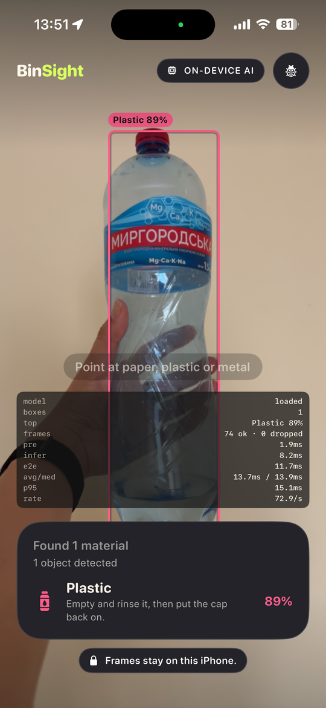
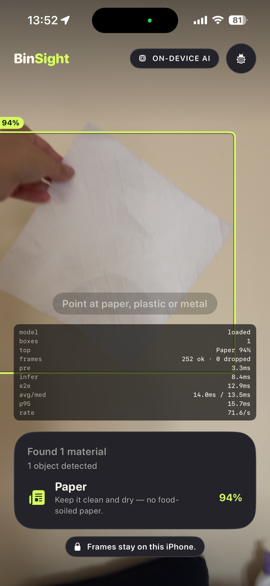
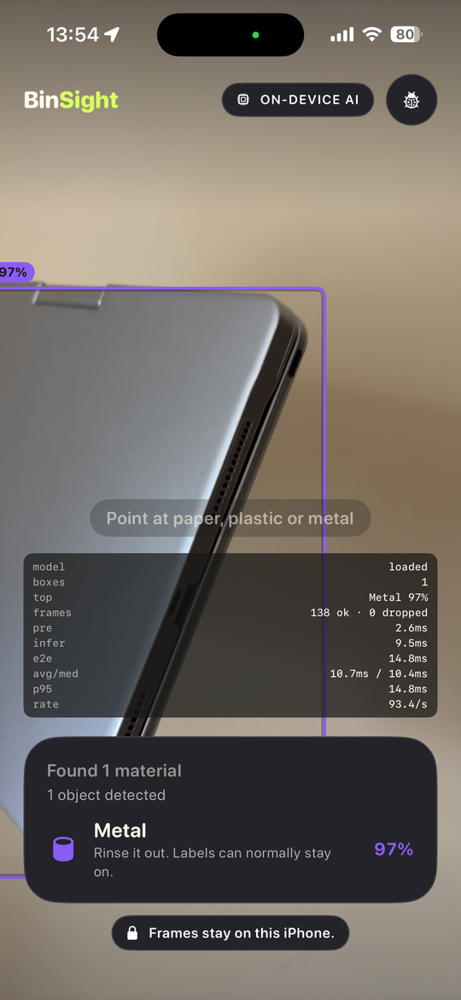
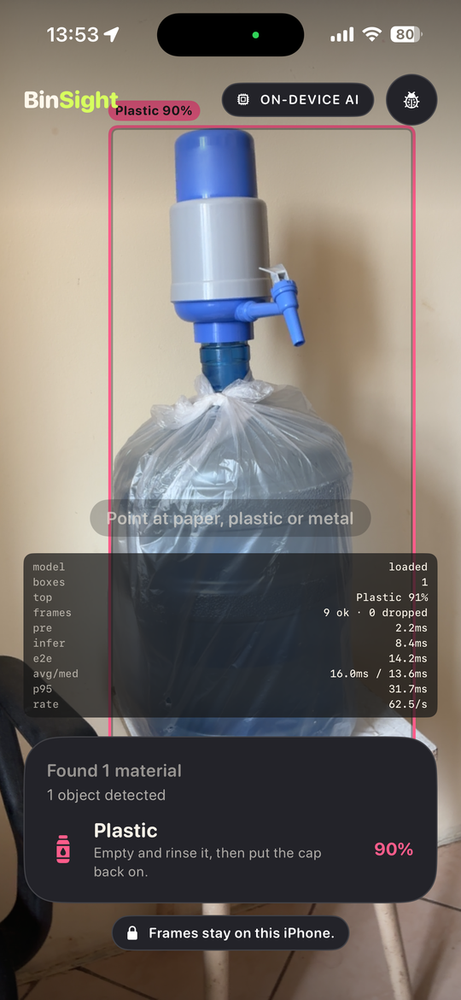
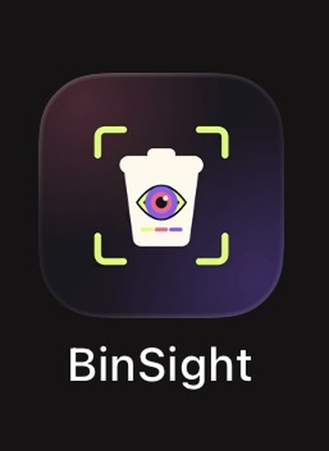

# ♻️ BinSight

> 📱 **iOS app** · 🧠 **YOLO26n object detection** · 🍎 **CoreML** · 🎯 **Real-time, fully on-device**

**On-device waste detection for iOS.** BinSight points the iPhone camera at a
scene and draws live bounding boxes around **paper**, **plastic** and **metal**,
using a YOLO26n object detector fine-tuned from COCO-pretrained weights and
exported to CoreML. Everything runs on the phone: no server, no API key, no
frame ever leaves the device.

The detector localises *and* classifies in a single pass. There is no second
classification stage, no segmentation, and — because YOLO26 is end-to-end — no
non-maximum suppression anywhere in the app.

> 🎯 **Held-out test mAP@50:** 0.6740 · **mAP@50-95:** 0.4976
> 📐 **PyTorch → CoreML mean box IoU:** 0.9924
> 🔒 **Deployment:** fully on-device CoreML inference, no network

---

## 🎥 Demo

Real captures from an iPhone 15. Not a simulator, not a mockup — the Simulator
has no camera, so it can only ever show the "camera unavailable" state.

| 🧴 Plastic | 📄 Paper | 🥫 Metal |
|---|---|---|
|  |  |  |
| Bottle · `Plastic 89%` | Tissue · `Paper 94%` | Laptop lid · `Metal 97%` |



The metal example is an aluminium laptop lid rather than a can. The model is
right — that surface *is* metal — but it is worth noting that BinSight answers
"what material is this?", not "is this rubbish?". It has no concept of whether an
object belongs in a bin.

**The dark panel is a DEBUG overlay, not part of the shipping app.** It is left in
these captures deliberately, because it is where the on-device timings in
[Performance](#-performance) come from: `infer 8.2ms`, `e2e 11.7ms`,
`74 ok · 0 dropped`. It is compiled out of Release builds entirely.

<br clear="right">



Installed on the Home Screen from a signed build.

BinSight is a **portfolio project and is not published to the App Store** —
licensing, not readiness. The detector inherits AGPL-3.0 from Ultralytics'
pretrained weights, and AGPL is incompatible with App Store terms. Build it from
source with Xcode. See [`LICENSING.md`](LICENSING.md); the App Store preparation
completed beforehand is kept in [`docs/app-store/`](docs/app-store/).

<br clear="left">

---

## ✨ Features

- 📷 **Live camera detection** — ~4 inferences/second from the video feed
- 🎯 **One box, the confident one** — the app surfaces only the single strongest
  detection, because at the 0.25 threshold roughly one box in four is wrong
- 🏷️ **Class and confidence** — drawn as an overlay (`Plastic 81%`)
- 📦 **Three material classes** — paper, plastic and metal
- 🍎 **Fully on-device CoreML** — no network, no server, no account
- 🧊 **Bounded memory** — one inference in flight, newest frame only, no backlog
- 🚦 **Honest failure states** — camera denied, camera unavailable, model unavailable

---

## 🧠 ML pipeline

```
📦  Roboflow object-detection dataset (6 classes)
     ↓  🧹 deterministic filtering + class remapping (seed 42, grouped split)
🗂️  3-class detection dataset — 5,074 images / 16,173 boxes
     ↓  🧠 fine-tuning from COCO-pretrained yolo26n.pt
🤖  YOLO26n detector, nc=3
     ↓  📊 held-out test evaluation
     ↓  🍎 FP16 CoreML export (.mlpackage)
     ↓  🔬 PyTorch ↔ CoreML parity validation
📱  iOS app — AVCaptureSession → letterbox → CoreML → SwiftUI overlay
```

---

## 📦 Dataset

| | |
|---|---|
| Images | **5,074** |
| Bounding boxes | **16,173** |
| Classes | `0 paper` · `1 plastic` · `2 metal` |
| Split | 4,059 train / 507 val / 508 test |
| Strategy | 80/10/10, seed 42, stratified by dominant class, grouped by source image |

Boxes per class: paper 4,387 · plastic 5,945 · metal 5,841.

The split is grouped by source-image identity so that augmented variants of the
same photo cannot straddle train and test. `scripts/validate_waste_dataset.py`
re-reads everything from disk independently of the preparation script and checks
label geometry, field counts, orphans, corrupt images and cross-split content
hashes. It reports 0 corrupt images, 0 invalid labels and 0 leakage.

<a id="source-and-attribution"></a>

### 📜 Source and attribution

This project uses a **filtered and re-mapped subset** of a third-party dataset.
It does not claim ownership of the source data.

> **Garbage Classification 3** (v2) — Roboflow Universe workspace
> `material-identification`.
> <https://universe.roboflow.com/material-identification/garbage-classification-3/dataset/2>
> Licensed **CC BY 4.0**, read from the `roboflow:` block of the source
> `data.yaml` rather than assumed.

The source has six classes. Three are excluded entirely and three are kept and
renumbered — the source order is *not* the final order:

| Source ID | Source name | Action | Final ID |
|---:|---|---|---:|
| 0 | BIODEGRADABLE | excluded | — |
| 1 | CARDBOARD | excluded | — |
| 2 | GLASS | excluded | — |
| 3 | METAL | kept | **2** |
| 4 | PAPER | kept | **0** |
| 5 | PLASTIC | kept | **1** |

`CARDBOARD` is excluded rather than merged into `paper`: the two are visually
adjacent, and folding one into the other would have made the remaining `paper`
class incoherent. `scripts/prepare_waste_dataset.py` reads the source class order
from the source `data.yaml` instead of hardcoding it, because hardcoding the
final order onto source ids would have mislabelled the dataset silently.

⚠️ **The raw dataset is not committed** — 123 MB of images and labels. The
preparation and validation scripts, `data.yaml`, the manifest and the reports
are, so the dataset can be rebuilt. See [Reproducing the ML work](#reproducing-the-ml-work).

📄 Full detail: [`datasets/binsight_waste_3class/dataset_report.md`](datasets/binsight_waste_3class/dataset_report.md).

---

## 🤖 Model

> 🧠 **YOLO26n, fine-tuned from official COCO-pretrained weights. Not trained
> from scratch.**

| | |
|---|---|
| Architecture | YOLO26n Detect (Ultralytics 8.4.9), 2.5 M parameters |
| Initialisation | `yolo26n.pt`, 80-class COCO — **606/708 tensors transferred**, head adapted 80 → 3 |
| Training | **65 epochs total** — 25 initial + 40 continuation, batch 4, imgsz 640, AdamW, seed 42, MPS (Apple M1) |
| Best epoch | 40 of the continuation run (no early stopping) |
| Duration | 6.85 h + 2.86 h |

Training ran in two stages. The first stopped at its 25-epoch limit while the
model was still improving — its best epoch *was* its last, and mAP50-95 had risen
0.0235 over the final five epochs. A 40-epoch continuation from that checkpoint
recovered from the inevitable dip caused by restarting the learning-rate schedule
and then went well past it, lifting held-out test mAP50-95 from 0.4620 to 0.4976.
The continuation's best epoch was again its last, so the model is *still* not
fully converged.

🛡️ The training script refuses to start unless the checkpoint is genuinely
pretrained: it asserts the checkpoint dict is present, the head is `Detect`, and
the BatchNorm running statistics are non-trivial — an untrained model has exactly
zero means and unit variances.

📄 Full detail: [`reports/yolo26n_training_report.md`](reports/yolo26n_training_report.md).

---

## 📊 Results

Validation guided checkpoint selection, so **the held-out test split is the
headline number** — quoting validation as final performance would report a figure
the model was selected on.

| Metric | Validation | **Held-out test** | Test Δ vs 25-epoch model |
|---|---:|---:|---:|
| Precision | 0.7502 | **0.7533** | +0.0716 |
| Recall | 0.6485 | **0.5744** | −0.0033 |
| mAP50 | 0.7159 | **0.6740** | +0.0260 |
| mAP75 | 0.5897 | **0.5266** | +0.0457 |
| mAP50-95 | 0.5425 | **0.4976** | +0.0356 |

Per class, on the held-out test split:

| Class | Precision | Recall | AP50 | AP50-95 |
|---|---:|---:|---:|---:|
| paper | 0.7395 | 0.4693 | 0.5818 | 0.4578 |
| plastic | 0.7421 | 0.5873 | 0.7001 | 0.4781 |
| metal | 0.7784 | 0.6667 | 0.7402 | **0.5568** |

The largest gain is **precision, +0.0716**, at essentially unchanged recall. That
is the most useful direction of improvement for this app: it shows one box, so
what matters is how often that box is right.

The val→test drop (mAP50-95 0.5425 → 0.4976) is about 0.045 — modest, and
consistent with mild selection bias rather than overfitting.

🥇 `metal` is the strongest class on both splits: cans and foil have hard edges
and consistent specular highlights. `paper` is the weakest, and its recall
actually fell to 0.4693 — it is deformable, often crumpled, and shades into
cardboard, a class the taxonomy deliberately excludes.

---

## 🔬 CoreML export & parity

Converting PyTorch → CoreML can silently transpose coordinates, reorder classes
or quantise a model into uselessness, and none of that shows up as an error. So
the exported package was checked against the PyTorch model it came from, on the
same 10 deterministic held-out images:

| | |
|---|---|
| PyTorch detections | 40 |
| CoreML detections | 40 |
| Geometry-matched | **38 / 40** |
| Class agreement | **100%** (38/38) |
| Mean matched-box IoU | **0.9924** (min 0.9685) |
| Mean confidence delta | 0.0168 (max 0.1619) |

Matching is on **geometry alone**, with class compared afterwards. Requiring the
class to agree *before* pairing would make "class agreement" tautologically 100%
— a disagreeing pair simply never becomes a pair.

Two measurement details are worth stating, because both were wrong at first:

- **Assignment is optimal, not greedy.** On an image of a pile of screws with 19
  boxes overlapping at IoU > 0.99, greedy pairing matched detections to the wrong
  twin and invented confidence deltas of 0.24.
- **Confidence is compared as a distribution, not pairwise.** Even optimal
  assignment is ambiguous when many boxes are near-identical — switching to it
  made the paired delta *worse* (0.24 → 0.39), which is the tell. Comparing
  sorted confidences rank-for-rank answers the real question and is immune to
  which twin got paired with which.

The one remaining outlier, 0.1619, was traced rather than waved away: PyTorch
emitted **two** near-identical boxes on a single bottle (IoU 0.986 with each
other), splitting its confidence across 0.762 and 0.537, while CoreML suppressed
the duplicate into one 0.924 detection. Same object, same class, boxes agreeing
at IoU 0.985 — CoreML was the cleaner of the two.

📄 Full detail: [`reports/coreml_export_report.md`](reports/coreml_export_report.md).

---

## 📱 iOS inference architecture

```
🎥  AVCaptureSession     1280×720, rotated to portrait 720×1280 BGRA, 4 fps
         ↓
🖼️  letterbox to 640×640  scale = min(640/w, 640/h), centred, RGB(114,114,114) pad
         ↓                for 720×1280: scale 0.5, padX 140, padY 0
🍎  BinSightYOLO26n      CoreML ML Program, FP16, computeUnits = .all
         ↓
🔢  [1, 300, 6]          rows of [x1, y1, x2, y2, confidence, class_id]
         ↓
🎚️  confidence ≥ 0.25    plus finite / x2>x1 / y2>y1 / known-class checks
         ↓
📐  xyxy un-letterbox    (v − pad) / scale, clamped to the frame
         ↓
🗺️  preview projection   buffer pixels → aspect-fill preview points
         ↓
🖥️  SwiftUI overlay      box + class + confidence
```

Four things that are easy to get wrong, and how this app handles them:

- 🚫 **No app-side NMS.** YOLO26 is end-to-end (`end2end = True`); the rows are
  already deduplicated and Ultralytics forces `nms=False` when exporting. Adding
  NMS would suppress genuinely overlapping objects — one evaluation image has 19
  valid overlapping `metal` boxes.
- 🔢 **No manual normalisation.** The exported input layer carries `scale = 1/255`.
  Dividing again in Swift would hand the model a near-black image.
- 📐 **Boxes are xyxy, not xywh.** Ultralytics' own `postprocess` docstring says
  xywh; for this checkpoint that is wrong, and decoding as xywh yields negative
  coordinates. Verified empirically against PyTorch.
- 🏷️ **The output feature name is not hardcoded.** The exported tensor is called
  `var_1441`, which is compiler-generated and unstable across re-exports; it is
  resolved from `MLModelDescription` at load time.

The overlay's coordinate mapping is the one place buffer pixels become preview
points. The preview is `.resizeAspectFill`, so it shows a *centre crop* — scaling
by `previewSize / bufferSize` is wrong by a translation as well as a scale, and a
unit test exists specifically to prove the naive version is wrong.

📄 Full detail: [`docs/DETECTION_PIPELINE.md`](docs/DETECTION_PIPELINE.md).

---

## ⚡ Performance

### 📱 On device — iPhone 15

Read from the DEBUG overlay across six live captures:

| | |
|---|---|
| Letterbox (CoreImage) | **1.9 – 4.0 ms** |
| CoreML inference | **7.6 – 9.5 ms** |
| End-to-end | **11.2 – 14.8 ms** |
| p95 | 14.8 – 31.7 ms |
| Frames dropped | **0**, across 74 / 252 / 311 / 356 / 138 / 9 frames |

Inference is roughly **4× faster on the phone than in the Simulator** — the
Neural Engine doing exactly what it exists for.

One number needs care: the overlay's `rate` (62–93/s) is capacity, computed as
`1 / average latency`. It is not the rate the app runs at. BinSight deliberately
throttles to **4 inferences per second** at the capture boundary, because more
than that burns battery without making the reading feel any more live. The
headroom is what guarantees zero dropped frames.

### 💻 In the Simulator — for comparison

> ⚠️ The Simulator has no Neural Engine. These are **not** iPhone figures, and
> are kept only to show the gap.

| | |
|---|---|
| Letterbox (CoreImage) | 2–4 ms |
| CoreML inference | 32–136 ms |
| End-to-end | 42–191 ms |

The spread is wide because the Simulator shares the host CPU. The model,
`CIContext`, pixel-buffer pool and output buffer are created once and reused;
nothing is allocated per frame.

---

<a id="tech-stack"></a>

## 🧰 Tech stack

📱 **iOS** — Swift 5, SwiftUI, AVFoundation, CoreML, CoreImage, CoreVideo,
swift-testing, XCTest (UI tests). iOS 17+.

🐍 **ML** — Python 3.11, PyTorch 2.13 (MPS), Ultralytics 8.4.9, coremltools 9.0,
NumPy, OpenCV, Pillow, PyYAML.

---

## 📁 Repository structure

```
BinSight/                      iOS app
  App/                         entry point
  Core/Detection/              Detection, LetterboxTransform, DetectionDecoder,
                               DetectionConfiguration, YOLODetectionService
  Core/Classification/         retired 6-class classifier types (see below)
  Core/DesignSystem/           theme, palette, glass surfaces
  Features/Scanner/            camera, live engine, overlay, UI components
  Resources/Models/            BinSightYOLO26n.mlpackage  ← bundled model
BinSightTests/                 unit + static CoreML integration tests
BinSightUITests/               scanner screen UI tests
scripts/                       dataset prep, training, evaluation, export, parity
datasets/binsight_waste_3class/  data.yaml + reports (images/labels not committed)
models/coreml/                 CoreML export workspace (package not committed)
reports/                       training and CoreML export reports
docs/                          architecture, model card, device testing
```

### 🎁 Release artifacts

Two, both committed, and they are the only two:

| Artifact | Path | Size | Role |
|---|---|---:|---|
| **PyTorch** | `models/pytorch/BinSightYOLO26n.pt` | 5.1 MB | the accepted training checkpoint |
| **CoreML** | `BinSight/Resources/Models/BinSightYOLO26n.mlpackage` | 4.8 MB | what the iOS app bundles and runs |

`models/pytorch/BinSightYOLO26n.pt` is byte-identical to the training run's
`best.pt` — SHA-256 `f6ca723341610b4d5f19856fcecbb30528193e2f7bed47c5d21deda539276c96`,
5,387,013 bytes. It is copied out of the run directory so the release model
survives in Git without the 460 MB of training output around it. With it
committed, CoreML can be re-exported, and the model re-evaluated, **without
retraining**.

⚠️ **`runs/` is not committed** — 460 MB of `last.pt`, 25 per-epoch checkpoints
from `save_period=1`, batch previews and plots. Only the final checkpoint above
is preserved.

`scripts/export_yolo26n_coreml.py` writes its output to `models/coreml/`, which is
then copied into `BinSight/Resources/Models/`. Only the app's copy is tracked —
committing both would put two byte-identical 4.8 MB blobs in Git. The small JSON
files in `models/coreml/` are the export and parity verification record and *are*
committed.

🗄️ **Retired code.** `LiveScanEngine`, `WasteClassifying`, `MockWasteClassifier`,
`PredictionSmoother` and `ScoreVector` implemented an earlier six-class TrashNet
classifier. They are disconnected from the production runtime — nothing in the
shipping path constructs them and no model backs them — but they still compile
and their tests still pass, so they were left in place rather than deleted along
with the behaviour those tests document.

---

<a id="reproducing-the-ml-work"></a>

## 🧪 Reproducing the ML work

Requires a Python environment with the packages listed under
[Tech stack](#tech-stack), and the source archive from Roboflow (link above)
placed at `datasets/_tmp/archive.zip`.

```bash
python scripts/prepare_waste_dataset.py      # build the 3-class dataset
python scripts/validate_waste_dataset.py     # independent re-read validation
python scripts/preview_waste_dataset.py      # render labels onto images to eyeball
python scripts/train_yolo26n.py --name binsight_yolo26n_pretrained_final \
       --batch 4 --epochs 25 --patience 7 --close-mosaic 5
python scripts/evaluate_yolo26n.py           # val + held-out test metrics
python scripts/export_yolo26n_coreml.py      # FP16 CoreML export
python scripts/verify_coreml_parity.py       # PyTorch ↔ CoreML parity
python scripts/make_ios_test_fixtures.py     # regenerate the Swift test fixtures
```

⏭️ Steps up to and including training are only needed to reproduce the model from
scratch. Because `models/pytorch/BinSightYOLO26n.pt` is committed, the export,
parity and fixture steps can be run directly against it:

```bash
python scripts/export_yolo26n_coreml.py --weights models/pytorch/BinSightYOLO26n.pt
```

Then copy the exported package into the app target:

```bash
rm -rf BinSight/Resources/Models/BinSightYOLO26n.mlpackage && cp -R models/coreml/BinSightYOLO26n.mlpackage BinSight/Resources/Models/
```

⚠️ **Training is not bit-reproducible.** The seed is fixed at 42 and the split is
deterministic, but PyTorch's MPS backend does not guarantee deterministic
reductions, so metrics will land close to — not identically on — the figures
above. The dataset build *is* deterministic and its manifest is committed.

---

## 🚀 Running the iOS app

Requires Xcode 16+ and a device or simulator on iOS 17+.

```bash
open BinSight.xcworkspace
```

Build the `BinSight` scheme. 📌 Open the **workspace**, not the `.xcodeproj`.

📷 The camera is only available on a physical device — the simulator has none, so
the app there shows its camera-unavailable state, which is the designed
behaviour. On first launch the app asks for camera permission
(`NSCameraUsageDescription`: *"BinSight uses the camera to classify waste items
on this device. Frames are not uploaded."*). Signing uses automatic provisioning;
select your own team.

Run the tests:

```bash
xcodebuild -workspace BinSight.xcworkspace -scheme BinSight -destination 'platform=iOS Simulator,name=iPhone 17 Pro' test
```

---

## ⚠️ Limitations

- 📦 **Three materials only.** Paper, plastic and metal. Cardboard, glass and
  organic waste are outside the taxonomy — the detector will either miss them or
  force them into one of the three classes.
- ⚖️ **This is not a recycling authority.** Guidance shown in the app is generic
  material advice, never a particular council's rules.
- 🎯 **Recall is 0.574 on the held-out test split.** Roughly two in five annotated
  objects are missed at the 0.25 threshold. It finds things reliably; it does not
  find everything — and the app shows only one box, so a frame with two materials
  names one of them.
- 📄 **Paper is the hardest class** (AP50-95 0.4578, recall 0.4693) and is the one
  most often confused with plastic on translucent or crumpled items.
- 📈 **The model is still not converged.** Both training stages ended on their
  best epoch, so more epochs would likely still help.
- 🔀 **Domain gap.** Training imagery is product-style photography at 416×416, not
  handheld camera frames at arm's length under kitchen lighting. Live performance
  can be expected to fall short of the test figures.
- 👁️ **Live accuracy has not been measured on device.** Latency has (see
  [Performance](#-performance)), but no held-out accuracy figure exists for
  handheld camera frames — only for the test split. The screenshots show
  successes, not a success *rate*.

---

## 🔮 Future work

- 🏋️ Train longer — both stages ended on their best epoch, so the model has not
  plateaued
- 🧩 Expand the taxonomy — cardboard and glass are the obvious next two
- 📸 Collect real handheld camera-domain images to close the domain gap
- ⚡ Measure and optimise latency on device; consider INT8 if it is justified
- 🎬 Record a demo capture

---

## 📜 Licence and attribution

The dataset is third-party and separately licensed — see
[Source and attribution](#source-and-attribution) and
[`THIRD_PARTY_NOTICES.md`](THIRD_PARTY_NOTICES.md).

⚖️ **This project is licensed AGPL-3.0** — see [`LICENSE`](LICENSE). It did not
choose to be: the licence is inherited from Ultralytics' pretrained weights, which
the detector is fine-tuned from, and the obligation follows the derived model into
the app.

That has a real consequence — AGPL is widely held to be incompatible with App
Store distribution — and [`LICENSING.md`](LICENSING.md) sets out what it means and
the three honest ways forward, rather than glossing over it.
