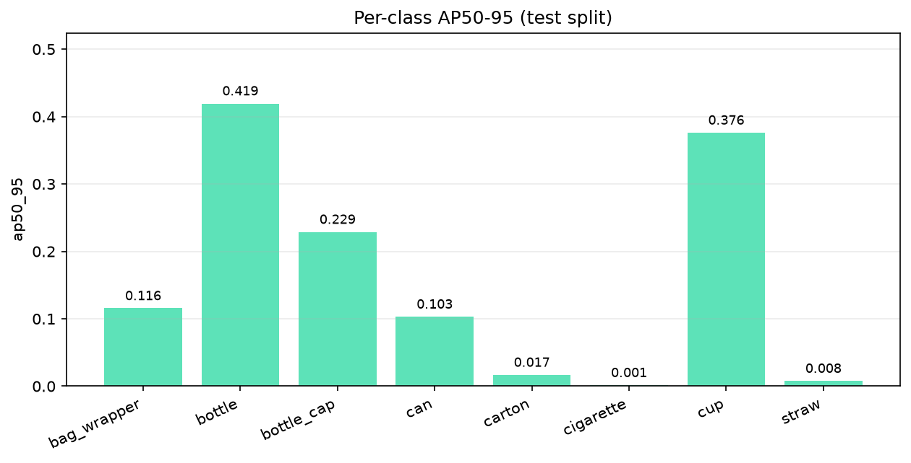
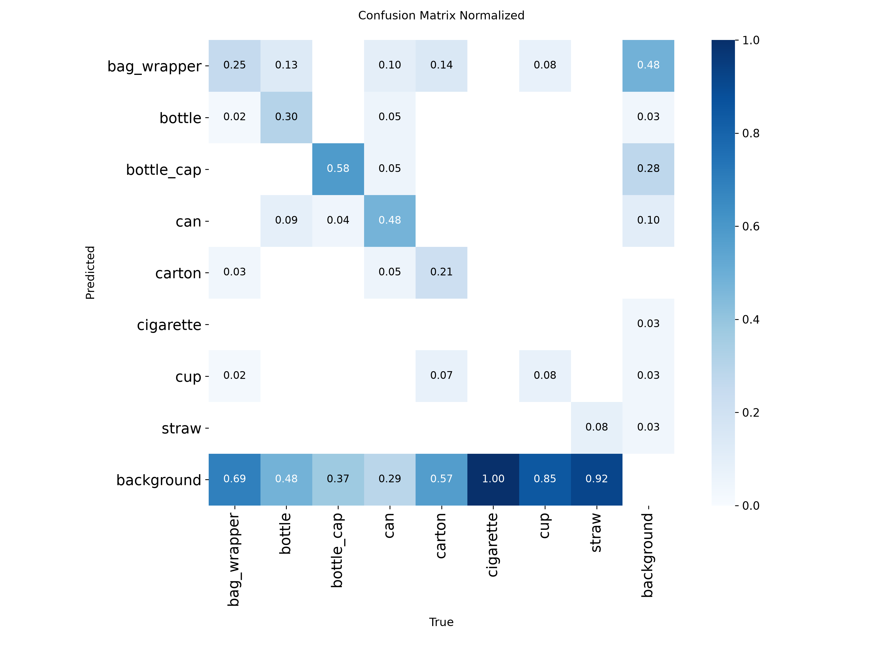
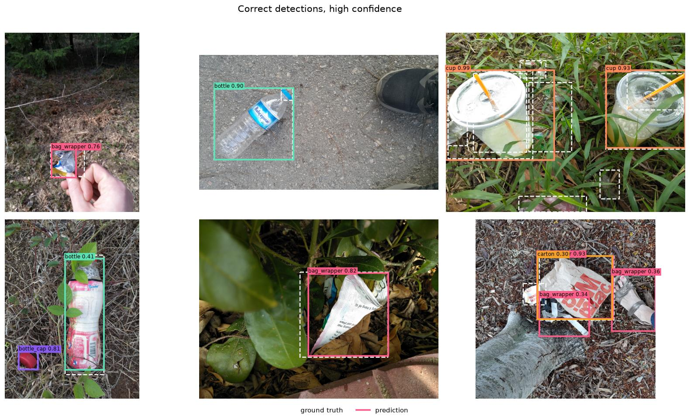
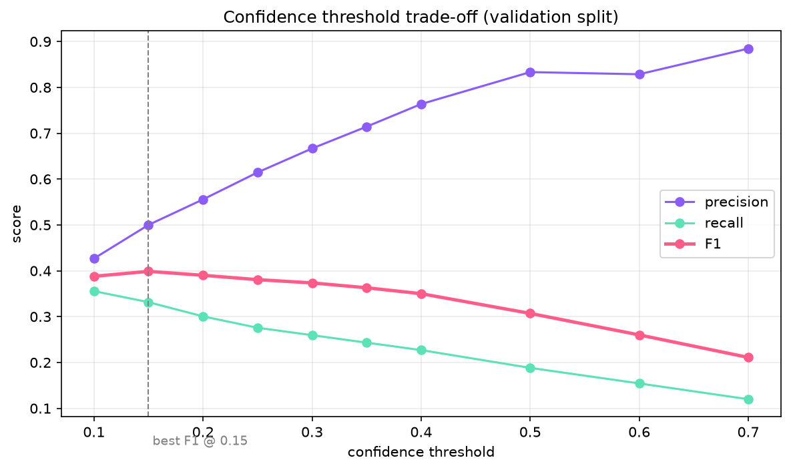

# TACO YOLO26 Detector

## Status

```
BRANCH ARCHIVED — no further training on this branch
Selected: Run 002 best.pt -> models/final/binsight_yolo26n_deployment.pt
Readiness: research_only
Next branch: YOLO26 Bounding-Box-Only + Memory-Safe Training
```

Two of the three YOLO runs here were **interrupted by host memory pressure**, not
by early stopping. They are preserved as-is — see
[`ml/reports/ml_v1_branch_handoff.md`](../../reports/ml_v1_branch_handoff.md) and
[`reports/ml_v1_archive_manifest.json`](reports/ml_v1_archive_manifest.json)
for the per-run state, epochs, best epochs and checkpoint hashes.

Three training runs, one selected. Every metric below is measured on an untouched
test split; nothing here is projected or estimated.

The selected detector finds roughly a quarter of objects in unrestricted scenes
and misses about nine in ten tiny ones. It is **not** production-ready, and the
reason is documented rather than glossed: see
[Why training stopped](#why-training-stopped). Read
[Run 002](#run-002--recovered-taco-640) for what was selected,
[Guided-framing diagnostic](#guided-framing-diagnostic) for why the product's
camera UX does not rescue it, and [Selected model](#selected-model) for the
deployment artefact.

## Motivation

The [TrashNet TensorFlow baseline](../trashnet_tensorflow_baseline/) reached
**83.38% test accuracy** and **0.8046 macro F1** on held-out TrashNet images, but
did not generalise reliably to uncontrolled live-camera scenes. Two problems,
one about data and one about architecture:

* TrashNet is isolated objects on clean backgrounds; BinSight sees clutter,
  variable lighting and partial objects;
* a whole-frame classifier answers *what is this?* but cannot answer *where is
  it?*, cannot handle multiple items, and cannot say "nothing here".

This experiment replaces it with a single object-detection model that predicts,
for every item it finds:

```
location + class + confidence
```

## Dataset

**TACO — Trash Annotations in Context**, <https://github.com/pedropro/TACO>

| | |
|---|---|
| Commit | `29de1a9ba05a647b83a90f18d7772e20bb23d846` (2023-02-13) |
| Annotations | `data/annotations.json` — the official reviewed file |
| Not used | `annotations_unofficial.json`, deliberately excluded from the first controlled experiment |
| Images | 1 500 referenced, hosted on Flickr |
| Annotations | 4 784 across 60 categories in 28 supercategories |

TACO's value is exactly what TrashNet lacked: waste photographed **in context** —
on pavements, in grass, against real backgrounds — with bounding boxes and
segmentation polygons rather than one label per image.

Its difficulties are equally concrete, and all of them were measured rather than
assumed (`reports/taxonomy/`):

* **A long tail.** 26 of 60 categories have fewer than 20 annotations; one has
  none at all.
* **Two categories dominate.** `Cigarette` (667, 13.9%) and `Unlabeled litter`
  (517, 10.8%) are a quarter of the dataset between them, and neither names a
  material.
* **Objects are small.** **67% of annotations occupy under 1% of the frame**;
  only 3.4% exceed 20%. TACO is street litter shot from standing height.
* **EXIF orientation.** 25% of images store raw sensor pixels with an
  Orientation tag, while the annotations use the corrected orientation — see
  [Data preparation](#data-preparation).

## Architecture

Planned:

```
YOLO26n Detect
```

Ultralytics 8.4.9, PyTorch 2.13.0, 2 572 280 parameters. Trained — see
[Run 001](#run-001).

## Data preparation

```
COCO → taxonomy audit → class mapping → deterministic split → YOLO labels → visual validation
```

Every stage is a script under `scripts/` and writes a report under `reports/`.

Two problems the pipeline caught that would otherwise have been silent:

**EXIF orientation.** For 152 of the downloaded images, the JPEG on disk is
landscape while `annotations.json` describes it as portrait — the file carries an
Orientation tag that neither PIL nor OpenCV applies by default. Boxes for a
quarter of the dataset landed in empty background. The converter now bakes the
rotation into a normalised copy for those images and symlinks the rest. **This
was found by looking at the rendered samples, not by any programmatic check** —
every coordinate was perfectly valid.

**Split assignment.** The first implementation of the multilabel-aware splitter
minimised the *remaining* deficit rather than assigning to the split furthest
behind, and put all 509 images into `val`. Caught by reading the output.

## Current mapping

Three candidates were built and measured (`reports/taxonomy/`):

| Candidate | Classes | Annotations used | Imbalance | Catch-all share |
|---|---:|---:|---:|---:|
| A — material-oriented | 5 | 3 440 (72%) | 12.58× | none |
| B — object-oriented, wide | 7 | 4 783 (100%) | 10.89× | 44% |
| **C — object-oriented, narrowed** | **8** | **3 143 (66%)** | **5.42×** | **none** |

**Recommended: C.** Full reasoning in
[`reports/taxonomy/recommended_mapping.md`](reports/taxonomy/recommended_mapping.md).
In short:

* **A** asks the detector to infer *material from pixels* — the exact inference
  the TrashNet baseline already showed does not survive real scenes. It also
  discards 28% of annotations as materially ambiguous and still leaves `plastic`
  holding 65% of what remains.
* **B** keeps everything, but 44% lands in `other_litter`. A class that large and
  that heterogeneous teaches the model to fire on anything litter-shaped. TACO's
  own official maps have the same problem (`map_4` 67% `Other`, `map_10` 36%).
* **C** keeps B's visual groupings and drops the residual instead of training on
  it. Every class is a thing a person can point a phone at and name.

Final classes, in class-ID order:

| ID | Class | Annotations |
|---:|---|---:|
| 0 | `bag_wrapper` | 872 |
| 1 | `bottle` | 438 |
| 2 | `bottle_cap` | 289 |
| 3 | `can` | 273 |
| 4 | `carton` | 251 |
| 5 | `cigarette` | 667 |
| 6 | `cup` | 192 |
| 7 | `straw` | 161 |

**The cost is 1 640 annotations (34%) becoming unlabelled background.** Where an
image holds both a mapped and a dropped object, the detector learns to treat the
dropped one as background. For BinSight that is arguably right — better silence
than "unidentified litter" — but it is a deliberate trade, not a free win.

## Run 001

| | |
|---|---|
| Model | YOLO26n, pretrained `yolo26n.pt` |
| Classes | 8 (object-oriented mapping, no catch-all) |
| Train / val / test images | 368 / 84 / 57 |
| Train / val / test annotations | 878 / 201 / 211 |
| Device | Apple M1, **PyTorch MPS** |
| Image size / batch | 640 / 8 |
| Epochs | 100 configured, **64 completed** (early stopping, patience 20) |
| Best epoch | **44** |
| Duration | 1.59 hours |
| Class weighting | none (imbalance 5.18x; `cls_pw` absent from Ultralytics 8.4.9) |

### Metrics

| Split | Precision | Recall | F1 | mAP50 | mAP75 | mAP50-95 |
|---|---:|---:|---:|---:|---:|---:|
| validation | 0.4483 | 0.2619 | 0.3306 | 0.2861 | 0.2357 | 0.2120 |
| **test** | **0.2696** | **0.1853** | **0.2197** | **0.2007** | **0.1696** | **0.1586** |

### Per class (test)

| ID | Class | P | R | F1 | AP50 | AP50-95 |
|---:|---|---:|---:|---:|---:|---:|
| 0 | `bag_wrapper` | 0.397 | 0.119 | 0.184 | 0.161 | 0.116 |
| 1 | `bottle` | 0.562 | 0.333 | 0.418 | 0.457 | 0.419 |
| 2 | `bottle_cap` | 0.474 | 0.380 | 0.422 | 0.326 | 0.229 |
| 3 | `can` | 0.237 | 0.150 | 0.184 | 0.134 | 0.103 |
| 4 | `carton` | 0.000 | 0.000 | 0.000 | 0.019 | 0.017 |
| 5 | `cigarette` | 0.000 | 0.000 | 0.000 | 0.004 | 0.001 |
| 6 | `cup` | 0.487 | 0.500 | 0.493 | 0.484 | 0.376 |
| 7 | `straw` | 0.000 | 0.000 | 0.000 | 0.020 | 0.008 |







## Error analysis

Test split, IoU >= 0.50, confidence >= 0.25: **24 true positives, 18 false
positives, 171 false negatives**, 16 class confusions, 2 poorly localised.

**Recall is the binding constraint, not precision.** The model misses roughly
seven objects for every one it finds. It is not confidently wrong so much as
mostly silent — which for a bin-advice app is the better of the two failure modes,
but is still failure.

* **Strongest: `cup`** (AP50 0.484, F1 0.493) — large, rigid, consistent silhouette.
* **`bottle`** next (AP50 0.457, AP50-95 0.419), and the most useful class for BinSight.
* **Weakest: `cigarette`** (AP50 0.004), with `straw` (0.020) and `carton` (0.019).
  All three scored zero precision and recall at 0.25 confidence. `cigarette` has a
  median size of 0.02% of frame — at 640px that is a handful of pixels.

| Ground truth | Predicted as | Count |
|---|---|---:|
| carton | can | 3 |
| cup | can | 2 |
| bottle | bag_wrapper | 2 |
| can | bag_wrapper | 2 |
| cup | bottle_cap | 2 |
| cigarette | bag_wrapper | 1 |

### Detection by object size

| Bucket | Ground truth | Detected | Recall |
|---|---:|---:|---:|
| tiny | 137 | 7 | 0.051 |
| small | 46 | 8 | 0.174 |
| medium | 26 | 8 | 0.308 |
| large | 2 | 1 | 0.500 |

The most informative table in the run. Recall falls from 0.500 on large objects to
**0.051 on tiny ones**, and 67% of TACO objects are tiny. The architecture has not
failed at detection — it has failed at small objects at 640px, which is a
resolution and data problem.

### Confidence threshold

Swept on validation, **not** carried over from the classifier's 0.65 — detection
confidence is a different quantity.

* **Balanced: 0.15** — precision 0.500, recall 0.332 (best F1).
* **High precision: 0.25** — precision 0.615, recall 0.276.



For an app advising people about bins, the high-precision setting is the right
default: a confidently wrong label is worse than silence.

## Run 001 conclusion at the time

> Superseded by Run 002 and the guided-framing diagnostic below. Kept as the
> reasoning that drove the next steps.

**Needs iteration.**

Not "promising baseline": test mAP50-95 of 0.159 is too low to build on without
changing something material. Not "not suitable" either — the failure is specific
and explainable rather than diffuse. `bottle`, `cup` and `bottle_cap` reached
usable AP, and the rendered predictions show tight, correct boxes at high
confidence. The architecture works; the run was starved.

Three reasons, in order of size:

1. **The dataset is a third of what it should be.** Flickr rate-limiting left 549
   of 1 500 images downloaded, so Run 001 saw **368 training images** and 878
   boxes across 8 classes. That is very little for detection.
2. **640px cannot resolve TACO's objects** — tiny-object recall 0.051.
3. **Three classes had too few training instances to learn**: `carton` (58),
   `cup` (58), `straw` (55).

The val-to-test gap (mAP50 0.286 → 0.201) is wide, but at 57 test images
that is as much sampling noise as genuine overfitting.

## Dataset recovery after Run 001

Item 1 of the next-step list below — "finish the download" — is done, as far as
it can be done.

Retrying Flickr was not the answer: the same rate limiter that cost Run 001 898
images was still returning HTTP 429 hours later, and per-image URLs are not
reproducible for anyone reading this in a year. The dataset was instead recovered
from the **archived Zenodo release** (DOI `10.5281/zenodo.3354286`), a single
1 110 MB file whose published MD5 `5c674548402b142d5a27a1f7b6a653f3` was verified
after download.

The archive turned out to predate the current annotation revision — it holds 715
images against `annotations.json`'s 1 500. Merging it with the images Flickr did
serve gives the best available set:

| | Images | Mapped annotations |
|---|---:|---:|
| Run 001 (Flickr only) | 509 | 1 290 |
| **Recovered (archive + Flickr)** | **1 082** | **2 671** |
| Official total | 1 500 | 4 784 |

**This is a *maximally recovered official subset*, 86.7% of TACO's image records
— not the complete dataset.** 200 records resolve from neither source. No image
was substituted from anywhere else.

Every recovered file was opened, decoded, hashed, and its EXIF-corrected size
checked against the COCO record: 0 unreadable, 0 dimension mismatches, 0
duplicate content hashes. That check is not ceremony — it is the defect that put
a quarter of Run 001's boxes in empty background, and it had to be proven absent
in the archive images too.

### What recovery changed

Every class roughly doubled; `cigarette`, Run 001's total failure, grew most
(186 → 537, 2.89×). Full table in
[`reports/dataset_recovery/run_001_vs_full_dataset.md`](reports/dataset_recovery/run_001_vs_full_dataset.md).

The uncomfortable part: **the recovered dataset is harder, not just bigger.** The
COCO-small share rose from 29.1% to 38.4%, because the images Flickr refused were
not a random sample of TACO. So Run 002's headline mAP is *not* directly
comparable to Run 001's — a flat number would still be consistent with a better
detector. The comparison has to be per class and per size bucket.

### Run 001 is frozen

`runs/yolo26n_run_001/` is not resumed, retrained, moved or overwritten;
`best.pt` still hashes to `304aefbd…1039a69`, verified by
`tests/test_dataset_recovery.py`. Its inputs are frozen with it, which is why
`data/partial_run_001/` holds symlinks rather than moved files — Run 001's
prepared images are absolute symlinks into `data/raw/`, and relocating that
directory would break the control run.

### Run 002 status

Prepared, validated and configured — **not trained**.

| Artefact | Path |
|---|---|
| Dataset | `data/prepared_run_002/` (1 082 images, 2 671 boxes) |
| Splits | `data/splits/run_002/` — 748 / 168 / 166, seed 42, no leakage |
| Dataset config | `configs/dataset_run_002.yaml` |
| Training config | `configs/train_run_002_planned.yaml` |
| Design and success criteria | `reports/dataset_recovery/experimental_design.md` |
| Cigarette decision procedure | `reports/dataset_recovery/cigarette_ablation_plan.md` |

One variable changes: the data. `imgsz` stays at 640, all eight classes stay
including `cigarette`, and Run 002 initialises from `yolo26n.pt` rather than Run
001's weights so the two runs remain comparable.

## Run 002 — recovered TACO, 640

1 082 images / 2 671 boxes, trained from `yolo26n.pt`, `imgsz=640`, `batch=8`,
seed 42. **Interrupted at epoch 24 of 100**, best epoch 20 — killed three times by
macOS memory pressure (no traceback, no OOM message: SIGKILL on a ~8.6 GB machine).
Preserved as an incomplete baseline, then selected on validation as the strongest
checkpoint available.

Full-frame test, 166 untouched images / 405 objects:

| P | R | F1 | mAP50 | mAP75 | mAP50-95 |
|---:|---:|---:|---:|---:|---:|
| 0.3158 | 0.2470 | 0.2772 | 0.2105 | 0.1637 | 0.1453 |

Per-class AP50-95: `can` 0.280, `bottle` 0.225, `bottle_cap` 0.195,
`bag_wrapper` 0.190, `carton` 0.141, `cup` 0.099, `cigarette` 0.021, `straw` 0.012.

Size recall: tiny **0.095**, small 0.213, medium 0.273, large 0.235.
Against Run 001: precision +0.046, recall +0.062, F1 +0.058, tiny recall +0.044.

## Run 003 — 768 + object-centric crops (incomplete)

The planned answer to Run 002's diagnosis that 86.5% of false negatives were tiny
or small: 768 px input plus 1 056 object-centric training crops built only from
training images, making each target a median **29x** larger in the training signal.
Val and test stayed byte-identical originals; leakage was tested, not assumed.

**It never finished.** Killed at 99% of epoch 15 (batch 447/451), same SIGKILL
signature. Frozen as `incomplete_due_to_host_memory_constraints` with 14 epochs,
best epoch 14, val mAP50-95 0.1703. That is a hardware outcome, not a model
result, and it is not compared against the completed runs.

Worth recording: at epoch 10 it was *ahead* of Run 002 on both val mAP50-95 and
recall (+0.068 recall, +31% relative). The recipe looked promising. It could not
be tested to conclusion on this machine.

## Guided-framing diagnostic

BinSight's UX asks the user to point at one item, so the obvious question is
whether framing rescues small objects without retraining. Measured, same weights,
nothing trained — full report in
[`reports/guided_framing_comparison.md`](reports/guided_framing_comparison.md).

| Mode | Recall | Precision | tiny recall | small recall |
|---|---:|---:|---:|---:|
| Full frame | 0.1531 | 0.4697 | 0.0988 | 0.2250 |
| Object-guided ROI | 0.1481 | 0.3581 | 0.1067 | 0.2250 |
| **Central 75%** | **0.1778** | 0.4235 | 0.1067 | **0.3125** |

**Object-guided ROI does not work.** Following each object through both framings:
38 rescued, 40 lost, net −2 — and that is the *oracle* case, a window centred on a
known object. A real user cannot aim better than that.

**Tiny objects are unmoved by any framing**, staying between 0.099 and 0.107. They
are 62% of the test set. Cropping cannot add detail the camera never captured.

**Recommended for iOS: central 75% ROI.** Recall 0.1531 → 0.1778, small-object
recall 0.2250 → 0.3125, precision 0.470 → 0.424.

## Selected model

| | |
|---|---|
| Path | `models/final/binsight_yolo26n_deployment.pt` |
| Source | Run 002 `best.pt`, epoch 20 |
| SHA-256 | `3f470d1abaf8bd615783a68836eefcf482bd771a437a91254d1a6f07c2ed276f` |
| Size | 15.72 MB |
| Inference size | 640 |
| Head | one-to-one end2end (NMS-free) |
| Balanced confidence | **0.30** (P 0.642, R 0.232, F1 0.341) |
| High-precision confidence | **0.50** (P 0.744, R 0.148) |
| iOS ROI | central 75% |
| **Readiness** | **research_only** |

Selected on validation only, against Run 001 and the incomplete 768 run. It won on
every criterion — fitness, mAP50-95, recall, precision — and on per-class
robustness: one failing class against Run 001's three.

## Why training stopped

Not because the model is good. Because further generic training is not what stands
between this and a working product.

1. **Data volume was tested and was not the answer.** 2.07x the data (Run 001 →
   Run 002) improved recall and precision but not mAP50-95. Across the eight
   classes, training-instance count correlates with AP50-95 at r = +0.06 —
   essentially not at all — while small-object share correlates at r = −0.52.
2. **Resolution could not be tested to conclusion** on ~8.6 GB of unified memory.
   Four SIGKILLs across two runs.
3. **Framing was tested and does not rescue tiny objects.** Measured above.

What remains is a **domain gap**: TACO is litter photographed from standing height
across whole scenes; a BinSight user holds a phone close to one item. Improvement
requires **real phone-camera photographs of single items**, not another
hyperparameter configuration.

## Known limitations

* **The dataset is still incomplete, at 86.7%.** Recovery took it from 509 to
  1 082 of 1 500 image records; the remaining 200 exist in neither the Zenodo
  archive nor anything Flickr will serve. Run 001's statistics describe its own
  509-image subset and were not recomputed. Anything trained on the recovered
  set should be described as trained on a *maximally recovered official subset*
  of TACO, not on TACO.
* **The recovered set is harder than Run 001's**, not merely larger: COCO-small
  share 29.1% → 38.4%. Cross-run mAP comparison is therefore invalid; compare
  per class and per size bucket.
* **TACO is small.** 1 500 images and 4 784 annotations, against ~118 000 images
  in COCO. Detection is a harder task than classification with less data.
* **Class imbalance remains**, 5.18× after mapping. `carton`, `cup` and `straw`
  each have fewer than 15 validation instances and are flagged in
  `reports/mapped_class_statistics.md`. Not addressed here — this step measures.
* **Object classes are not disposal classes.** `bottle` spans PET and glass;
  `cup` spans polymer, board and foam. A bin recommendation will need either a
  material head or a second stage.
* **`cigarette` is 0.02% of frame at the median** — the smallest objects in the
  dataset, and the second-largest class. It may need a higher input resolution
  than the rest, or to be dropped if it degrades the others.
* **The domain gap moved, it did not close.** TACO is litter on the ground shot
  from standing height; BinSight users hold a phone close to one item. Better
  than TrashNet's studio backgrounds, still not the target distribution.

## Reproducing

```bash
conda env create -f ml/experiments/taco_yolo26_detector/environment.yml
cd ml/experiments/taco_yolo26_detector
```

| Step | Command |
|---|---|
| Environment + MPS + YOLO26n check | `python scripts/inspect_environment.py` |
| Download images (resumable) | `python scripts/download_taco.py --workers 3` |
| Audit the taxonomy | `python scripts/audit_taco.py` |
| Build and compare mappings | `python scripts/build_class_mapping.py` |
| Deterministic splits | `python scripts/create_splits.py` |
| Convert to YOLO | `python scripts/convert_coco_to_yolo.py` |
| Validate labels | `python scripts/validate_yolo_dataset.py` |
| Render samples | `python scripts/visualise_annotations.py` |
| Tests | `python -m pytest tests -q` |

Dataset recovery and Run 002 preparation, in order:

| Step | Command |
|---|---|
| Recover the official archive (1.1 GB, MD5-verified) | `python scripts/recover_official_dataset.py` |
| Index and validate every official image | `python scripts/index_official_images.py` |
| Run 002 splits | `python scripts/create_splits_run_002.py` |
| Build the Run 002 YOLO dataset | `python scripts/prepare_run_002.py` |
| Validate it | `python scripts/validate_yolo_dataset.py --prepared data/prepared_run_002 --report-dir reports/dataset_recovery --report-prefix run_002_yolo_validation` |
| Compare against Run 001 | `python scripts/compare_run_001_vs_full.py` |
| Render Run 002 samples | `python scripts/visualise_annotations.py --prepared data/prepared_run_002 --out reports/samples/run_002_dataset` |

None of these touch Run 001. `validate_yolo_dataset.py` and
`visualise_annotations.py` default to Run 001's paths, so the commands in the
first table are unchanged.

Run them inside `BinSight_YOLO`:

```bash
conda run -n BinSight_YOLO --no-capture-output python scripts/audit_taco.py
```

## Comparison with the TrashNet baseline

The two experiments cannot be compared by a single number — one classifies whole
images, the other localises objects. Capabilities compare; metrics do not.

| Property | TrashNet TensorFlow baseline | TACO YOLO26 detector |
|---|---|---|
| Task | Whole-image classification | Object detection |
| Localises object | No | **Yes** |
| Predicts class | Yes | Yes |
| Dataset context | Mostly isolated objects | In-context litter |
| Multi-object frame | Not naturally | **Yes** |
| Primary metrics | Accuracy 83.38%, macro F1 0.8046 | P/R/mAP — test mAP50 0.2007, mAP50-95 0.1586 |
| Intended mobile path | TFLite (shipped) | Later CoreML (not exported) |
| Production direction | Baseline only | Candidate, not yet |

Writing "83.38% accuracy vs 0.16 mAP" would be meaningless: the baseline
was scored on pre-cropped single-object images, the detector on full scenes where
it must also find the object in the first place.
