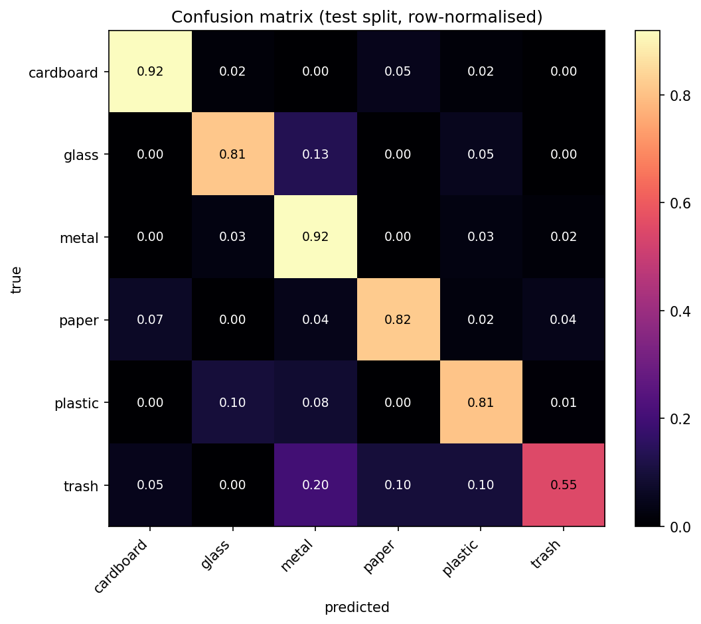
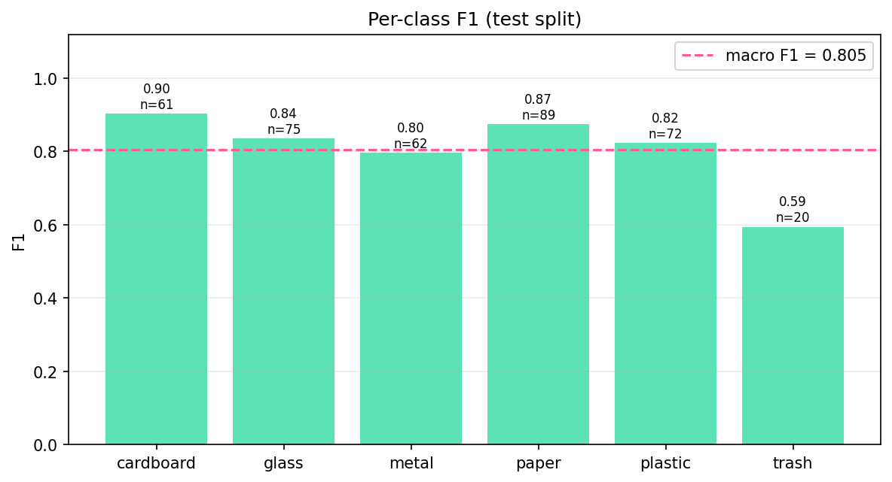
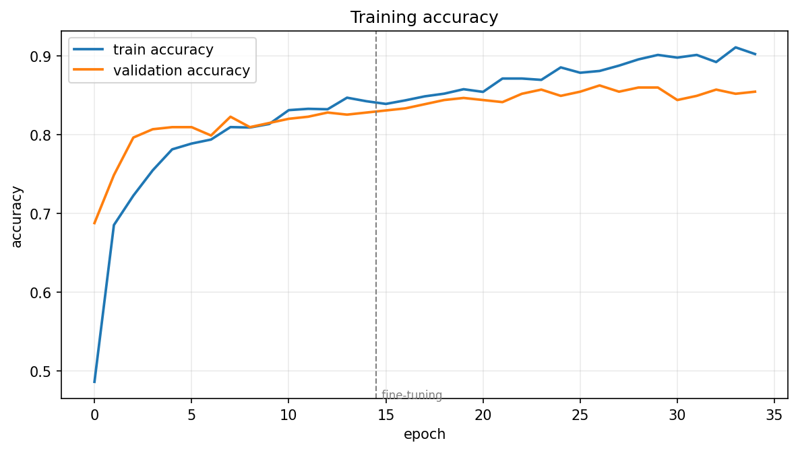

# TrashNet TensorFlow Baseline

**Status:** completed baseline · superseded by the planned TACO + YOLO26 detector
**Test accuracy:** 83.38% · **Macro F1:** 0.8046

## Overview

BinSight's first proof-of-concept approach:

```
camera image → image classification → one of six waste categories
```

The question this experiment set out to answer was narrow and practical: *can a
small TensorFlow classifier trained on TrashNet give BinSight an acceptable
on-device waste classifier?* The whole pipeline — dataset validation, training,
evaluation, TFLite export and verification, iOS integration — was built and run
end to end so the answer would rest on measurements rather than expectation.

The answer turned out to be **not on its own**, and the reason is more
interesting than the headline number. See [Limitations](#limitations).

## Dataset

**TrashNet** — <https://github.com/garythung/trashnet>, `dataset-resized.zip`
(512×384 JPEGs). MIT licence; the repository asks to be cited. See
[`THIRD_PARTY_NOTICES.md`](../../../THIRD_PARTY_NOTICES.md).

Counted by `scripts/prepare_dataset.py`, not quoted from the paper
(`reports/dataset_summary.json`, `reports/split_verification.json`):

| Class | Images | Train | Validation | Test |
|---|---:|---:|---:|---:|
| cardboard | 403 | 282 | 60 | 61 |
| glass | 501 | 351 | 75 | 75 |
| metal | 410 | 287 | 61 | 62 |
| paper | 594 | 416 | 89 | 89 |
| plastic | 482 | 337 | 73 | 72 |
| trash | 137 | 97 | 20 | 20 |
| **Total** | **2 527** | **1 770** | **378** | **379** |

Validation found **0 corrupt or unreadable files** and **3 groups of
byte-identical duplicates**. Every image was fully decoded rather than
header-checked, because `PIL.Image.verify()` passes truncated JPEGs that then
fail during training.

Class imbalance is **4.34×** (paper vs trash). That ratio is the single most
important number for reading the results below: `trash` is roughly a quarter the
size of `paper`, and it shows.

## Model

Verified from `reports/training_summary.json` and `src/binsight_training/model.py`.

| | |
|---|---|
| Framework | TensorFlow 2.13.1 / Keras 2.13.1 |
| Backbone | **MobileNetV3Small**, ImageNet-pretrained, `include_top=False` |
| Input | 224 × 224 × 3, RGB, NHWC, float32 in **[0, 255]** |
| Head | GlobalAveragePooling2D → Dropout 0.25 → Dense(6) |
| Output | softmax over 6 classes |
| Loss | sparse categorical cross-entropy |

**Preprocessing is baked into the graph.** MobileNetV3's Keras implementation
carries `include_preprocessing=True`, which puts the [0,255] → [-1,1] rescaling
inside the model. The exported TFLite file therefore accepts raw pixel values
and the Swift client has no normalisation constants to get wrong — historically
the most common cause of a model that trains well and then underperforms on
device.

Augmentation was applied **only** in the training `tf.data` pipeline, never in
the exported inference graph: horizontal flip, ±6° rotation, ±8% translation,
±12% zoom, mild contrast. No hue or saturation jitter — colour and transparency
*are* the material cue separating glass from plastic.

Confidence behaviour: a class is named only at ≥ 0.65 probability, otherwise the
app shows "Not sure". That threshold lives in `configs/default.yaml` and is
mirrored by `ScannerConfiguration.minimumConfidence` in the iOS app.

## Training

Ran on an Apple Silicon Mac (8 GB unified memory), Python 3.9.7.

**TensorFlow Metal acceleration was evaluated, but the final training run used
CPU execution**, because the tested training configuration encountered Metal
runtime issues: with `tensorflow-metal` 1.1.0, batch 32 aborted with SIGABRT
partway through stage A and batch 16 aborted with SIGSEGV at epoch 2. Both
failures occurred mid-run rather than at setup. Metal remained enabled and
verified for everything other than `model.fit()` — device detection, tensor ops,
Keras forward passes and TFLite conversion all worked. This is an observation
about one configuration on one machine, not a general statement about
TensorFlow Metal workloads. `reports/environment_report.txt` records it, and
`scripts/train.py --device gpu` re-tests it after a plugin upgrade.

CPU training completed in about 15 minutes at ~24 s/epoch:

| Stage | Backbone | Epochs | LR | Duration | Best val_loss |
|---|---|---:|---:|---:|---:|
| A | frozen | 15 | 1e-3 | 5.2 min | 0.5130 |
| B | top 30% unfrozen | 20 | 1e-5 | 9.6 min | **0.4316** |

Stage B improved validation loss, so the fine-tuned weights were kept — that
comparison is made in code, not assumed. BatchNorm stayed frozen throughout:
with ~1 700 training images, batch statistics are too noisy to improve on
ImageNet's.

Split: stratified 70/15/15, `seed=42`, grouped by **content hash** so
byte-identical duplicates could not straddle a boundary and inflate the test
score. Balanced class weights were applied because of the 4.34× imbalance.
Callbacks: early stopping on validation loss with best-weight restoration,
best-only checkpointing, and `ReduceLROnPlateau`. Batch size 16.

## Results

Evaluated once on the untouched 379-image test split
(`reports/test_metrics.json`).

| Metric | Result |
| --- | ---: |
| Test accuracy | **83.38%** |
| Macro F1 | **0.8046** |
| Weighted F1 | **0.8341** |

Per class:

| Class | Precision | Recall | F1 | Support |
|---|---:|---:|---:|---:|
| cardboard | 0.8889 | 0.9180 | **0.9032** | 61 |
| paper | 0.9359 | 0.8202 | 0.8743 | 89 |
| glass | 0.8592 | 0.8133 | 0.8356 | 75 |
| plastic | 0.8406 | 0.8056 | 0.8227 | 72 |
| metal | 0.7037 | 0.9194 | 0.7972 | 62 |
| trash | 0.6471 | 0.5500 | **0.5946** | 20 |

Macro F1 (0.8046) sits meaningfully below accuracy (0.8338) precisely because
`trash` — the smallest and least visually coherent class — performs worst.
Reporting accuracy alone would have hidden that.

At the 0.65 confidence threshold the model would name a class for **87.3%** of
test images, and be correct on **89.1%** of those
(`reports/threshold_report.json`).







Also in `reports/`: `classification_report.txt` / `.csv`,
`predictions/test_predictions.csv` (full probability vector per image),
`predictions/misclassified_examples.csv`, per-epoch logs in `logs/`, and example
grids of correct, incorrect and low-confidence predictions in `figures/`.

### Quantisation

Every candidate was run over the full test split and compared against Keras
(`reports/tflite_verification.json`):

| Candidate | Size | Accuracy | Macro F1 | Top-1 agreement | Outcome |
|---|---:|---:|---:|---:|---|
| float32 | 3.76 MB | 0.8338 | 0.8046 | 1.0000 | eligible |
| **float16** | **1.94 MB** | 0.8311 | 0.8022 | 0.9974 | **selected** |
| int8 | 1.24 MB | 0.5567 | 0.4843 | 0.5963 | rejected |

int8 lost **27.7 points of accuracy and 32.0 points of macro F1**. Had the
selection rule been "take the smallest", the shipped model would have been
barely better than guessing. The rule instead rejects any candidate losing more
than 2 percentage points on *either* metric, then prefers a float input/output
contract, then the smallest file.

Local latency (this Mac, CPU — **not** iPhone): float32 3.56 ms, float16
3.46 ms, int8 6.04 ms mean over 100 runs. See `reports/tflite_benchmark.json`.

## What worked

- The **end-to-end pipeline works and is reproducible**: dataset validation,
  deterministic hash-grouped splits, two-stage transfer training, single-shot
  test evaluation, three-way quantisation, verification and selection.
- The model **classifies isolated waste images competently** — 83.38% across six
  classes from ~1 700 training images is a reasonable transfer-learning result.
- **TFLite conversion is verified**, not merely successful: contract checks on
  tensor shapes and dtypes, finite-probability checks, and full test-split
  agreement against Keras (99.74% top-1 for the selected model).
- The model is **compact enough for on-device use** — 1.94 MB, builtin ops only,
  no Flex delegates — and it ran on a physical iPhone 15.
- A **six-class baseline and a deployment contract now exist** to measure the
  next architecture against.

## Limitations

The headline accuracy is not the main finding. The main finding is a
**domain-generalisation problem**.

TrashNet images are studio-like: predominantly a single object, centred, well
lit, against a clean light background, at a consistent distance. BinSight is
intended to operate on live iPhone camera frames containing arbitrary
backgrounds, clutter, varying lighting, perspective, different object scales,
partial occlusion, and objects occupying only part of the frame.

The behaviour observed on device is consistent with substantial dataset/domain
shift: performance on TrashNet-style test images did not translate reliably to
uncontrolled camera scenes. Note the wording — no experiment here isolates
*which* image features the model relies on, so this README does not claim the
model "learned the background". What is established is that in-distribution test
performance and live-camera behaviour diverged.

A second, architectural limitation compounds it. **Whole-frame classification
forces the classifier to process the entire image**, most of which is background
the model was never trained to ignore. BinSight partially mitigates this by
cropping to the on-screen reticle before inference (`FrameCropPlan` /
`PreviewCropGeometry` in the iOS app), but that only helps once the user has
already framed a single item well — it does not solve the general case.

Further limitations, all verifiable from the reports:

- **~2 500 images total** is small for six-way material classification.
- **`trash` has 137 images and F1 0.5946** — a residual category rather than a
  material, so it has both the least data and the least coherent visual
  definition.
- The **confidence score is not calibrated**. Softmax outputs are not
  probabilities of being correct; no temperature scaling or reliability analysis
  was performed.
- **Single label only** — no "multiple items" and no "not a waste item" output.
- **No real-world evaluation set exists**, so the size of the domain-shift drop
  is described qualitatively rather than measured.
- No fairness or geographic evaluation was performed. TrashNet reflects one
  collector's mid-2010s American/European packaging; composites such as coffee
  cups, crisp packets and Tetra Pak barely appear, and those are exactly the
  items people are most unsure about.

**TrashNet performance does not demonstrate reliable real-world recycling
classification.**

## Why this approach was not selected for production

Two reasons, in order of weight.

**1. In-distribution accuracy was not sufficient evidence.** 83.38% held-out
accuracy *within the TrashNet distribution* says little about uncontrolled
camera scenes, and the divergence observed on device confirmed that. A model
that is right five times in six on studio photographs is not yet a model that
can be trusted to advise someone about their bin.

**2. Classification alone cannot answer the right question.** BinSight needs
both:

```
Where is the waste object?     ← classification cannot answer this
What type of waste is it?      ← classification answers this
```

A whole-frame classifier returns a single label for everything in view. It
cannot localise, cannot handle multiple items in one frame, and cannot report
that nothing recognisable is present. Those are not tuning problems; they lie
outside what the architecture can express.

## Next iteration

```
TrashNet + TensorFlow classification
              ↓
          baseline
              ↓
TACO + YOLO26 object detection
```

The next experiment replaces whole-frame classification with a single
object-detection model returning, for each detected item:

- a bounding box;
- a waste class;
- a confidence score.

| | |
|---|---|
| Dataset | **TACO** — Trash Annotations in Context |
| Model family | **YOLO26** |
| Initial mobile candidate | **YOLO26n** |
| Task | object detection |
| Target | on-device iOS inference |

TACO is the intended dataset specifically because its images are *in context* —
waste photographed in real environments rather than isolated on a clean
background — which addresses the domain shift identified above at the data
level, while detection addresses it at the architecture level.

**No YOLO26 results exist yet.** This section describes planned work only.

## Reproducing the baseline

The Conda environment lives outside the repository by design; `environment.yml`
is what is committed. From the repository root:

```bash
conda env create -f ml/experiments/trashnet_tensorflow_baseline/environment.yml
```

Then work from the experiment directory:

```bash
cd ml/experiments/trashnet_tensorflow_baseline
```

| Step | Command |
|---|---|
| Environment report | `make inspect` |
| Dataset + splits | `make prepare` |
| Smoke test | `make smoke-test` |
| Training | `make train` |
| Evaluation | `make evaluate` |
| TFLite export | `make export` |
| Verify + select | `make verify` |
| Benchmark | `make benchmark` |
| Tests | `make test` |
| Everything | `make all` |

Or without `make`:

```bash
PYTHONHASHSEED=42 conda run -n binsight-trashnet-metal --no-capture-output \
  python scripts/train.py --config configs/default.yaml
```

The dataset is downloaded by `scripts/prepare_dataset.py` into `data/raw/`
(gitignored) and is never committed.

## Artefacts

```
models/
├── keras/
│   └── binsight_trashnet.keras          trained model, stage-B fine-tuned (4.2 MB)
└── tflite/
    ├── binsight_trashnet.tflite         SELECTED — a copy of the float16 candidate
    ├── binsight_trashnet_float32.tflite baseline for numerical comparison
    ├── binsight_trashnet_float16.tflite the selected candidate (1.94 MB)
    └── binsight_trashnet_int8.tflite    rejected: −27.7 pp accuracy
```

`models/keras/checkpoints/` and `models/saved_model/` are gitignored — both are
regenerable from the committed `.keras` model.

`notebooks/` holds an earlier, **never-executed** Colab notebook and its unfilled
template artefacts (`labels.template.txt`, `model_contract.template.json`), kept
for historical context. They were superseded by `scripts/`, and their
placeholder label order differs from the verified one — the authoritative files
are `labels.txt` and `model_contract.json` in this directory.

## Relationship to the iOS app

The iOS application bundles a **copy** of the selected model at
`BinSight/Resources/Models/binsight_trashnet.tflite`, together with `labels.txt`
and `model_contract.json`. That copy is derived from
`models/tflite/binsight_trashnet.tflite` in this experiment and carries the same
SHA-256 (`c6cebd0c48d53b09701298a3b07581ab29dfedb31af2a5a63ffedc877032d501`),
which `BinSightTests/BundledModelTests.swift` asserts on every test run.

Relocating this experiment did not change the app's runtime behaviour.
